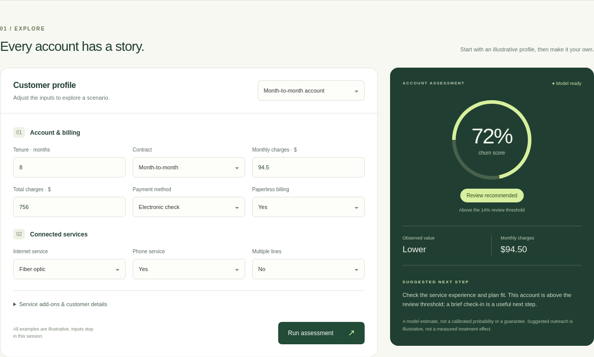
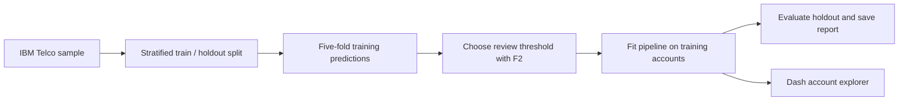

# Retain · Telecom Customer Churn

A machine learning case study that combines **churn risk with observed customer value** to explore retention priorities. It includes a reproducible benchmark and an interactive Dash app where reviewers can assess illustrative customer profiles.

**Python 3.10–3.12 · scikit-learn · pandas · Dash**

[Quick start](#quick-start) · [Results](#results) · [Model card](docs/model-card.md) · [Original coursework](archive/coursework/README.md)



[Desktop screenshot](docs/images/demo.png) · [Mobile screenshot](docs/images/mobile.png).

## The question

A retention team needs to decide which accounts warrant a closer look. Churn prediction gives one part of that picture; historical customer charges add context for prioritizing outreach.

This project explores four classes—higher/lower observed value crossed with churn/no churn—and compares that approach with binary models. The demo sums the two churn-class scores, applies a threshold selected from training data, and displays the account's known value tier alongside the result.

The benchmark shows the tradeoff clearly: the four-class model finds **89.0% of holdout churners**, while **43.1% of its flagged accounts are actual churners**. Binary gradient boosting has slightly better average precision in this run. Historical charges are a value proxy; the experiment does not establish revenue saved or retention uplift.

## Quick start

Clone the repository and use Python 3.10–3.12:

```bash
git clone https://github.com/Kaung-Nyo-Lwin/customer-churn-prediction.git
cd customer-churn-prediction
python -m venv .venv
source .venv/bin/activate
python -m pip install -r requirements.txt
python model_train.py
python main.py
```

Open **http://127.0.0.1:8080**. On Windows, activate the environment with `.venv\Scripts\Activate.ps1` in PowerShell.

Training generates the local model artifact and reports. It performs five-fold evaluation for four models, so allow a few minutes on a typical laptop. The model is generated locally rather than committed. See [running and development](docs/running.md) for custom runs and Gunicorn serving.

## Explore an account

1. Choose a month-to-month account, an established account, or a new connection.
2. Adjust account history, billing, and services. Additional customer details are available in the expandable section.
3. Select **Run assessment** to see the churn score, observed-value tier, and an illustrative next step.

The app validates inputs, excludes unavailable service add-ons, and marks previous results as stale after a profile edit. All example profiles are illustrative. Scores are uncalibrated model estimates; suggested outreach is exploratory.

## Results

The selected IBM Telco sample contains **7,043 accounts**, including **1,869 churners (26.5%)**. All models share a churn-stratified 80/20 split with seed 42: 5,634 training accounts and **1,409 holdout accounts**.

| Model | Average precision | ROC AUC | Churn recall | Precision | Accounts flagged |
| --- | ---: | ---: | ---: | ---: | ---: |
| Dummy (prior) | 0.265 | 0.500 | 100.0% | 26.5% | 1,409 |
| Logistic regression | 0.634 | 0.842 | 92.2% | 43.7% | 790 |
| Binary gradient boosting | 0.661 | 0.844 | 89.8% | 43.3% | 776 |
| Value-aware gradient boosting | 0.652 | 0.842 | 89.0% | 43.1% | 773 |

Each model's alert threshold maximizes F2 on five-fold out-of-fold **training** scores. Thresholds are fixed before holdout evaluation. The value-aware model uses a 14% threshold: it catches 333 of 374 churners, misses 41, and flags 440 non-churners.

The four-class model is retained in the demo to explore the original research question. Its four-class argmax accuracy is **80.1%**, which is separate from binary churn recall. Results come from one holdout split and should be read with the [model card's limitations](docs/model-card.md#limits-and-next-experiments).

Full metrics, confusion matrices, environment versions, and data/split fingerprints are in the generated [benchmark](reports/benchmark.md) and [JSON report](reports/benchmark.json).

## Engineering decisions

- **One input contract:** training and the app share the same 19 features, including tenure. Identifiers and the churn label stay outside the predictors.
- **Preprocessing within each fold:** imputation, one-hot encoding, scaling, and the value cutoff are learned from fitting data. The holdout remains separate.
- **Correct churn accounting:** confusing higher/lower value tiers does not count as missed churn when the summed churn score crosses the review threshold.
- **Comparable baselines:** a dummy model, logistic regression, and binary boosting provide context for the four-class experiment and its review workload.
- **Inspectable artifacts:** the saved model includes its input schema, threshold, and matching report. Pinned runtime dependencies support reproduction.



## Repository guide

```text
churn/                 Shared data, modeling, evaluation, reporting, and app modules
assets/                App styles and favicon
main.py                Local and WSGI app entry point
model_train.py         Reproducible training command
Datasets/              Selected dataset and historical candidates; see its README
artifacts/             Locally generated model files (ignored by Git)
reports/               Current benchmark JSON and generated Markdown
docs/                  Model card, running guide, and actual app screenshots
tests/                 Data, modeling, and callback regression tests
archive/coursework/    Original notebooks, scripts, reports, model, and figures
.github/workflows/     Automated source, test, training, and startup checks
```

## Development

```bash
python -m pip install -r requirements-dev.txt
python -m ruff check .
python -m ruff format --check .
python -m pytest -q
```

Tests run without a prebuilt demo model. GitHub Actions additionally reproduces training and checks app startup on Python 3.10 and 3.12. See [the running guide](docs/running.md) for details.

## Project origin and attribution

This repository develops an Asian Institute of Technology class project by **Kaung Nyo Lwin** and **Patsachon Pattakulpong** into a reproducible portfolio case study. The [coursework archive](archive/coursework/README.md) retains the original report, presentation, notebooks, and experiment outputs. Current benchmark results come from the refreshed workflow described above.

The selected dataset is from the IBM Telco Customer Churn sample family, collected through Kaggle during the coursework. See [dataset notes](Datasets/README.md), [IBM's sample description](https://community.ibm.com/community/user/blogs/steven-macko/2019/07/11/telco-customer-churn-1113), and [IBM's example repository](https://github.com/IBM/telco-customer-churn-on-icp4d) for attribution.
